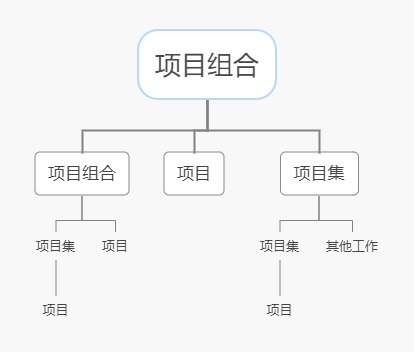
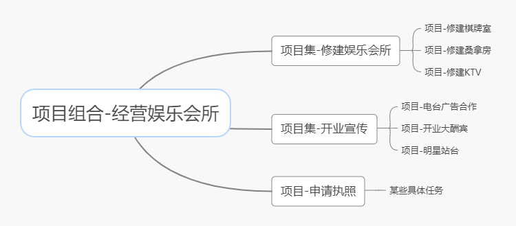

# 讨论 projects、 programs、和 portfolio 之间的关系以及对企业成功的贡献；以及与operations以及OPM之间的关系。

- 请先阅读《PMBok6》 中文版，第一部分的 1.2.3 节；第二部分 1.2节
- 必须描述projects、 programs、 portfolio 、 operations 和 OPM 的概念
- 必须用图或表格表达它们之间的关系与区别，使得读者更容易理解
- 必须列举合适案例用以区别这些概念

 

### 概念：

- projects：项目是指为创造独特的产品、服务或成果而进行的临时性工作，项目是为了组织的经营需要与战略目标服务的。临时性是指项目有明确的起点和终点。项目创造的产品、服务或成果一般不具有临时性。
- programs：项目集是一组相互关联且被协调管理的项目、子项目集和项目集活动，以便获得分别管理所无法获得的效益。项目集中的项目通过产生共同的结果或整体能力而相互联系。
- portfolio：项目组合是为了实现战略业务目标而组合在一起的项目、项目集、子项目组合和运营工作工作。项目组合中的项目不一定彼此依赖或有直接关系。
- operations：运维是一种持续的或者可重复的活动，它采用相关的方法、手段、技术、制度、流程和文档 等，对运行环境、业务系统等进行综合管理。
- OPM：组织级项目管理是为了实现战略目标而整合项目组合、项目集和项目管理与组织驱动因素的框架。

 

### 关系与区别：

|      |                             项目                             |                            项目集                            |                           项目组合                           |
| :--: | :----------------------------------------------------------: | :----------------------------------------------------------: | :----------------------------------------------------------: |
| 范围 | 项目是具有明确的目标。范围在整个项目生命周期中是渐进明细的。 | 项目集的范围包括其项目集组件的范围。项目集通过确保各项目集组件的输出和成果协调互补，为组织带来效益。 |       项目组合的组织范围随着组织战略目标的变化而变化。       |
| 变更 |  项目经理对变更和实施过程做出预期，实现对变更的管理和控制。  | 项目集的管理方法是，随着项目集个组件成果和/或输出的交付，在必要时接受和适应变更，优化效益实现。 |          项目组合经理持续监督更广泛内外部环境的变更          |
| 规划 | 在整个项目生命周期中，项目经理渐进明细高层级信息，将其转化为详细的计划。 | 项目集的管理利用高层级计划，跟踪项目集组件的依赖关系和进展。项目集计划也用于在组件层级指导规划。 | 项目组合经理建立并维护与总体项目组合有关的 必要过程和沟通。  |
| 管理 |            项目经理为实现项目目标而管理项目团队。            | 项目集由项目经理管理，其通过协调项目集组件的活动，确保项目集效益按预期实现。 | 项目组合经理可管理或协调项目组合管理人员或对总体目标组合负有报告职责的项目集和项目人员。 |
| 监督 |    项目经理监控项目开展中生产产品、提供服务或成果的工作。    | 项目集经理监督项目集组件的进展，确保整体目标、进度计划、预算和项目集效益的实现。 | 项目组合经理监督战略变更以及总体资源分配、绩效成果和项目组合风险 |
| 成功 | 成功通过产品和项目的质量、时间表、预算的依从性以及客户满意度水平进行衡量。 | 项目集的成功通过项目集向组织交付预期效益的能力以及项目集交付所属效益的效率和效果进行衡量。 |     成功通过项目组合的总体投资效果和实现的效益进行衡量。     |

 

|                 项目                 |                       运维                       |
| :----------------------------------: | :----------------------------------------------: |
|               临时性的               |                     持续性的                     |
|      创造独特的产品、服务或成果      |            生产重复的产品、服务和成果            |
| 有明确的的终点，目标实现时，项目结束 | 目标实现后，会根据新的指令继续支持组织的战略计划 |

 

 

### 具体事例：

